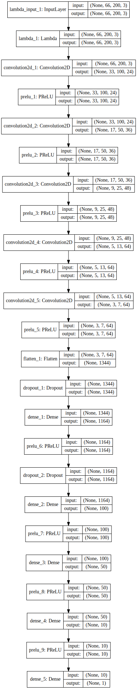

# CarND-Behavioral-Cloning-P3

_The README thoroughly discusses the approach
taken for deriving and designing a model architecture
fit for solving the given problem._

_The README provides sufficient details of the
characteristics and qualities of the architecture,
such as the type of model used, the number of layers,
the size of each layer. Visualizations emphasizing
particular qualities of the architecture are
encouraged._

_The README describes how the model was trained and
what the characteristics of the dataset are.
Information such as how the dataset was generated and
examples of images from the dataset should be included._

