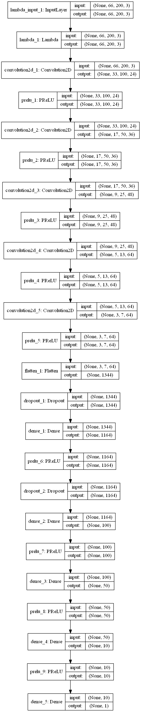
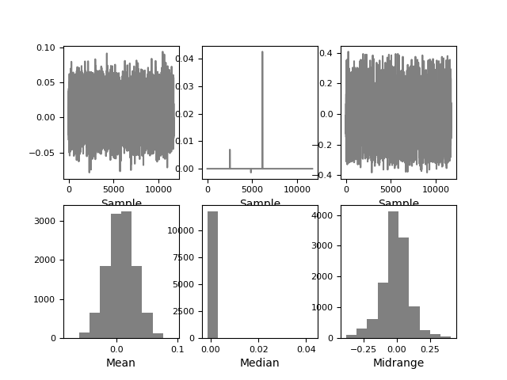
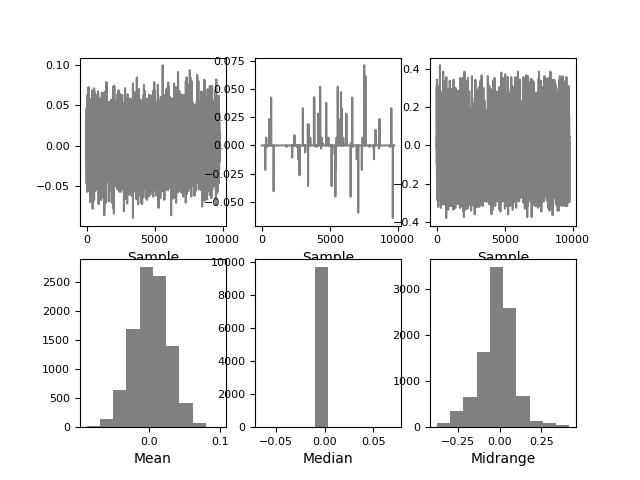

[](https://codeclimate.com/github/avrabe/CarND-Behavioral-Cloning-P3)
[](https://travis-ci.org/avrabe/CarND-Behavioral-Cloning-P3)
# CarND-Behavioral-Cloning-P3

_The README thoroughly discusses the approach
taken for deriving and designing a model architecture
fit for solving the given problem._


## The model
I've derived my model from the NVIDIA model describe in [End to End Learning for Self-Driving Cars](https://arxiv.org/abs/1604.07316).
The image size of the input was adjusted according to the NVIDIA model.
In addition a normalization layer was added directly after the input layer.
Instead of Relu I used [PReLU](https://keras.io/layers/advanced-activations/) which in
addition also contains a learning parameter.
After flattening I've added also several Dropout layer
to combat overcommitment. The overall picture can be seen below.



The default optimizer is Adam and the loss function the mean square error.
It was chosen after testing several optimizer and loss functions.


_The README provides sufficient details of the
characteristics and qualities of the architecture,
such as the type of model used, the number of layers,
the size of each layer. Visualizations emphasizing
particular qualities of the architecture are
encouraged._


_The README describes how the model was trained and
what the characteristics of the dataset are.
Information such as how the dataset was generated and
examples of images from the dataset should be included._
## Training data
To train the model the data set Udacity [provided](https://d17h27t6h515a5.cloudfront.net/topher/2016/December/584f6edd_data/data.zip) was mainly used.
Additionally I've added a small set of specific training data for the
last curve before reaching the start point again.

Mainly the center images are used. In addition the left and right images
(when available) is used. For the left and right image an additional adjustment
is added. Afterwards the distribution looks like:
[](distribution.png)
To enhance the effect of the left and right steering images, the amount
of images with a steering degree of 0 is reduced. For the training
the distributed then looks like:
[](distribution-filtered.png)

The data afterwards is split into a train and validation set.

During training and validation the data was doubled by adding a flipped
image with the inverse steering angle.

Additional enhancements like transformation of the image have not been
applied. The basic code is added but the tests have not been successful.

## To train the model
Training the model can be done using below command line.
```sh
python model.py -l <path_to_data> -e 20 --samples_per_epoch 10000 --validation_samples_per_epoch 2000 --batch_size 100
```

The output will look like:
```sh

```