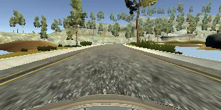
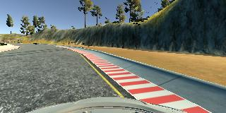
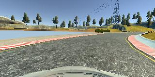

[](https://codeclimate.com/github/avrabe/CarND-Behavioral-Cloning-P3)
[](https://travis-ci.org/avrabe/CarND-Behavioral-Cloning-P3)
# CarND-Behavioral-Cloning-P3


## The model
I've started with the NVIDIA model describe in
[End to End Learning for Self-Driving Cars](https://arxiv.org/abs/1604.07316).
The image size of the input was adjusted according to the model.
In addition a normalization layer was added as starting layer.
After testing a while with the model I've did some changes which
improved the model. Instead of Relu I used [PReLU](https://keras.io/layers/advanced-activations/)
which in addition also contains a learning parameter.
After flattening I've added also several Dropout layer
to combat overcommitment.


After testing several optimizer and loss functions I choose as optimzer
Adam and as loss function mean square error. I've reduced the learning rate
after testing to 0.0001. The samples per epoch have been set to 10000,
the validation samples per epoch to 2000 and the batch size to 100. The values
also have been chosen after testing different values.

The code for the full model is:

```python
   model.add(Lambda(lambda x: x / 255 - 0.5, input_shape=(66, 200, 3)))
    model.add(Convolution2D(24, 5, 5, border_mode='same', subsample=(2, 2)))
    model.add(PReLU())
    model.add(Convolution2D(36, 5, 5, border_mode='same', subsample=(2, 2)))
    model.add(PReLU())
    model.add(Convolution2D(48, 5, 5, border_mode='same', subsample=(2, 2)))
    model.add(PReLU())
    model.add(Convolution2D(64, 3, 3, border_mode='same', subsample=(2, 2)))
    model.add(PReLU())
    model.add(Convolution2D(64, 3, 3, border_mode='same', subsample=(2, 2)))
    model.add(PReLU())
    model.add(Flatten())
    model.add(Dropout(0.8))
    model.add(Dense(1164))
    model.add(PReLU())
    model.add(Dropout(0.5))
    model.add(Dense(100))
    model.add(PReLU())
    model.add(Dense(50))
    model.add(PReLU())
    model.add(Dense(10))
    model.add(PReLU())
    model.add(Dense(1))
```

## Training data
To train the model the data set Udacity
[provided](https://d17h27t6h515a5.cloudfront.net/topher/2016/December/584f6edd_data/data.zip) was used.
No further data was chosen. I've tried to collect data using the simulator
with keyboard, mouse and joystick. The quality of the received data however always
led to bad models.

Some examples of the data used are:

|  image           |   |  |  |
|------------------|-----------------------------------------------------------------|----------------------------------------------------------------|----------------------------------------------------------------|
|  steering angle  |  0                                                              | -0.307052                                                      | 0.8002764                                                      |

Besides the center images, also the left and right images are used.
There is an offset added to the steering for the left and right images.
After this process the distribution of the steering data looked like:

[](distribution.png)

Looking at this data, the was an imbalance of steering angles to the left,
right and no steering. First the amount of left, right and no steering data was
adjusted and afterwards the amount of no steering data was further capped.
This was described in the NVIDIA paper and also created for me better results.
The distribution of the steering data was afterwards changed to:

[](distribution-filtered.png)

The resulting data set was split into a train and validation set.
A separate, very small, test set was used to get a first understanding
if the model is worth testing.

While training the model, the amount of data was further increased by:
- Flipping the image horizontal and inverting the steering angle
- Adding a brightness to the image

Additional enhancements like transformation of the image have not been
applied. The basic code is added but the tests have not been successful.


## To train the model
Training the model can be done using below command line.
```sh
curl -o /tmp/data.zip https://d17h27t6h515a5.cloudfront.net/topher/2016/December/584f6edd_data/data.zip
unzip -qq /tmp/data.zip -d /tmp
python model.py -l /tmp/data -e 5  --samples_per_epoch 10000 --validation_samples_per_epoch 2000 --batch_size 100
```


## Testing the data

```sh
python drive.py model.json
```

## Conclusion

With the model now up an running, it would be a good starting point to
further evaluate the quality of other models like comma.ai or VGG16.
One lesson I've learned is that it is very important to have a clean
data set as otherwise the model will never reach any good point.